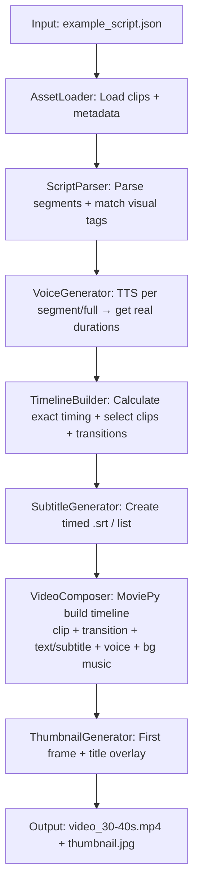

**MVP Thiết kế Hệ thống Sản xuất Video (Phiên bản Đơn giản hóa - No Login, No DB, No Expensive API Gen)**

**Mục tiêu MVP**  
Tạo video **30-40 giây** (phong cách aesthetic triết lý như video mẫu: trà đạo, hoa sen, nến, hands pouring...) từ **script có cấu trúc** + **pre-collected short video clips** (từ Pexels/Pixabay - miễn phí, royalty-free).  

Không dùng LLM/API tốn tiền để gen ảnh/video mới. Chỉ dùng **clip có sẵn** (2-10 giây mỗi clip) được thu thập và lưu local.  

**Output rõ ràng**: 1 file video MP4 (có chuyển cảnh mượt, voice, subtitle sync chính xác) + 1 thumbnail.jpg.  

**Yêu cầu kỹ thuật cốt lõi**:
- Script có **time from-to** (hoặc estimated duration + tự tính thực tế).
- **Chuyển cảnh** (crossfade/dissolve).
- **Sync hoàn hảo**: Video clip ↔ Voice segment ↔ Subtitle text.
- Title mở đầu + Ending card.
- Dễ test với **dummy data** (bạn chỉ cần bỏ clip mẫu vào folder là chạy được).
- CLI đơn giản (không UI).

**Thư viện chính khuyến nghị cho MVP** (Python):
- **MoviePy** (rất mạnh cho composition, timeline, text overlay, transitions, audio mix — dễ đọc code, phù hợp prototype).
- **pydub** (xử lý audio, đo duration chính xác, concat voice segments).
- **edge-tts** hoặc **pyttsx3** (TTS; edge-tts hỗ trợ xuất subtitle .srt luôn).
- **Pillow** (thumbnail + text overlay đơn giản).
- **srt** (xử lý file phụ đề) hoặc tự viết.
- **pathlib + json + dataclasses** (quản lý data).
- **FFmpeg** (cài sẵn hệ thống — dùng qua subprocess hoặc MoviePy backend).
- Tùy chọn: `python-ffmpeg` hoặc `ffmpeg-python` nếu muốn thuần FFmpeg sau này.

MoviePy là lựa chọn số 1 cho MVP vì Pythonic, hỗ trợ tốt transitions, TextClip, CompositeVideoClip, audio mixing. Sau này có thể tối ưu bằng FFmpeg thuần nếu cần tốc độ cao hơn.

**Cấu trúc thư mục MVP (đơn giản)**

```
mvp_video_generator/
├── assets/
│   ├── clips/                  # Short video clips (2-10s)
│   │   ├── tea_pour_01.mp4
│   │   ├── lotus_closeup_01.mp4
│   │   ├── candle_tea_01.mp4
│   │   └── ...
│   ├── metadata.json           # Mô tả clip (id, tags, duration, path)
│   └── music/
│       └── calm_bg.mp3         # Nhạc nền thư thái (loop/trim)
├── scripts/
│   └── example_script.json     # Input script mẫu
├── output/                     # Kết quả
├── main.py                     # Orchestrator
├── modules/
│   ├── asset_loader.py
│   ├── script_parser.py
│   ├── timeline_builder.py
│   ├── voice_generator.py
│   ├── subtitle_generator.py
│   ├── video_composer.py
│   └── thumbnail_generator.py
└── requirements.txt
```

---

### 1. Luồng Hoạt động Tổng thể (End-to-End Flow)



**Trình tự gọi trong main.py** (rất rõ ràng để bạn debug từng bước):

1. Load assets (clips + music).
2. Parse script → segments.
3. Generate voice (đo duration thực tế).
4. Build timeline (sync tất cả).
5. Generate subtitles.
6. Render video.
7. Tạo thumbnail.

---

### 2. Chi tiết từng Module (Input / Output + Thư viện)

#### Module 1: AssetLoader
**Mục đích**: Quản lý clip có sẵn + nhạc nền.

**Input**: Folder `assets/clips/` + `metadata.json`  
**Output**: Dict `clips_by_tag` (ví dụ: {"tea_pour": [list clip objects], "lotus": [...]}) + music_path

**metadata.json mẫu** (bạn tự tạo sau khi download clip từ Pexels/Pixabay):
```json
{
  "clips": [
    {
      "id": "tea_pour_01",
      "path": "assets/clips/tea_pour_01.mp4",
      "tags": ["tea", "pour", "hands"],
      "duration": 4.2,
      "description": "Hand pouring tea from teapot"
    },
    {
      "id": "lotus_01",
      "path": "assets/clips/lotus_closeup_01.mp4",
      "tags": ["lotus", "flower"],
      "duration": 5.8
    }
  ]
}
```

**Thư viện**: `pathlib`, `json`

#### Module 2: ScriptParser
**Mục đích**: Đọc script và map visual cue → clip tag.

**Input**: `example_script.json` (bạn cung cấp)  
**Output**: List segments: `[{"id": 1, "text": "当你看清了一个人...", "visual_tag": "tea_pour", "est_duration": 6.0}, ...]`

**example_script.json mẫu** (30-40s tổng):
```json
{
  "title": "放下",
  "subtitle": "清茶一杯 品味人生",
  "total_target_duration": 35,
  "segments": [
    {
      "id": 1,
      "text": "当你看清了一个人而不揭穿，你就懂得了格局的意义。",
      "visual_tag": "tea_pour",
      "est_duration": 7
    },
    {
      "id": 2,
      "text": "当你讨厌一个人而不翻脸，你就明白了释然的重要性。",
      "visual_tag": "lotus",
      "est_duration": 6
    },
    {
      "id": 3,
      "text": "人生如茶，沉时坦然，浮时淡然。",
      "visual_tag": "candle_tea",
      "est_duration": 8
    }
  ],
  "ending_text": "拿得起，放得下。"
}
```

**Thư viện**: `json`, simple rule-based matching (tag → clip).

#### Module 3: VoiceGenerator
**Mục đích**: Tạo voiceover + đo duration chính xác để sync.

**Input**: List segments (text)  
**Output**: 
- `voice_segments`: List [{"segment_id": , "audio_path": "temp/voice_1.mp3", "duration": 6.8, "start_time": 0.0}, ...]
- Hoặc full `voice_full.wav`

**Cách sync tốt**: Generate TTS **per segment** → dùng `pydub` đo duration thực → cập nhật timeline. Tránh lệch.

**Thư viện khuyến nghị**:
- `edge-tts` (chất lượng cao, hỗ trợ tiếng Trung/Việt tốt, có thể xuất .srt)
- `pydub` (đo duration, concat nếu cần)
- `pyttsx3` (offline, đơn giản)

#### Module 4: TimelineBuilder
**Mục đích**: Xây dựng timeline thống nhất (quan trọng nhất cho sync).

**Input**: Segments + selected clips + voice durations  
**Output**: Timeline object (list dict):
```json
[
  {
    "segment_id": 1,
    "start": 0.0,
    "end": 6.8,
    "clip_path": "assets/clips/tea_pour_01.mp4",
    "clip_trim_start": 0,
    "clip_trim_end": 6.8,
    "text": "...",
    "transition": "crossfade",
    "transition_duration": 0.5
  },
  ...
]
```

**Logic matching clip**: Ưu tiên tag khớp → random nếu nhiều clip cùng tag.  
**Tổng duration** tự tính từ voice thực tế → trim/adjust clip cho vừa.

**Thư viện**: `dataclasses` hoặc dict.

#### Module 5: SubtitleGenerator
**Mục đích**: Tạo phụ đề timed.

**Input**: Timeline  
**Output**: 
- File `temp/subtitles.srt`
- Hoặc list timed text cho MoviePy

**Thư viện**: `srt` (pip install srt) hoặc tự viết format SRT đơn giản.

#### Module 6: VideoComposer (Core Rendering)
**Mục đích**: Ghép tất cả thành video cuối cùng + chuyển cảnh + overlay.

**Input**: Timeline + voice audio + bg music + subtitles  
**Output**: `output/final_video.mp4` (1080x1920 vertical hoặc 1920x1080)

**Quy trình bên trong (MoviePy)**:
- Với mỗi segment: `VideoFileClip(clip_path).subclip(trim_start, trim_end)`
- Thêm transition: `.crossfadein(0.5)` hoặc `.fx(vfx.fadein)`
- Text overlay (title, quote) hoặc burn subtitles.
- Audio: voice track + bg music (volume thấp, loop/trim).
- Title mở đầu (3-5 giây text lớn centered + fade).
- Ending card (text "人生如茶" + fade out).
- `CompositeVideoClip` + `concatenate_videoclips` + `write_videofile` (codec h264, fps 30).

**Chuyển cảnh**: Crossfade 0.3-0.8s giữa các clip.

**Thư viện chính**: **MoviePy** (rất mạnh ở đây).  
Fallback: `subprocess` gọi FFmpeg trực tiếp (nhanh hơn cho production sau).

#### Module 7: ThumbnailGenerator
**Mục đích**: Tạo thumbnail đẹp cho video.

**Input**: Final video hoặc clip đầu tiên + title text  
**Output**: `output/thumbnail.jpg`

**Cách làm**: 
- Extract frame đầu (MoviePy hoặc FFmpeg).
- Dùng **Pillow** overlay text lớn (title + subtitle) + logo nếu có.
- Style: Warm tone, font thanh lịch (cần chỉ định font path hỗ trợ Unicode).

**Thư viện**: `Pillow`, `moviepy` (extract frame).

---

### 3. Ví dụ Input/Output Dummy (Bạn có thể test ngay)

**Chạy thử**:
```bash
python main.py --script scripts/example_script.json --output output/my_video.mp4
```

**Kết quả mong đợi**:
- Video ~35 giây.
- Mở đầu: Text "放下" to + subtitle.
- Giữa: Clip trà/lotus/nến chuyển cảnh mượt + voice đọc quote + subtitle hiện đúng lúc.
- Cuối: Text "人生如茶, 拿得起 放得下".
- Thumbnail: Frame đẹp + text overlay.

---

### 4. Lưu ý Quan trọng cho Sync & Chất lượng MVP

- **Timeline là nguồn chân lý duy nhất** → mọi thứ (clip, voice, subtitle) đều theo start/end từ đây.
- Đo duration **thực tế** từ voice (pydub) thay vì estimate.
- Clip trim chính xác theo segment duration.
- Transition ngắn (0.5s) để tổng thời lượng vừa 30-40s.
- Font cho TextClip: Chỉ định đường dẫn font hỗ trợ tiếng Trung/Việt (ví dụ Noto Sans CJK hoặc Arial Unicode).
- Test từng module riêng lẻ trước khi ráp (ví dụ: chỉ chạy VoiceGenerator với dummy segments).
- Clip chất lượng: Chọn clip 4K/HD ngắn, aesthetic, có motion chậm rãi. Trim sẵn nếu cần bằng FFmpeg command đơn giản.

**Cách thu thập clip ban đầu** (miễn phí):
- Vào Pexels.com hoặc Pixabay.com → search "tea pouring", "lotus flower close up", "candle tea aesthetic", "hands pouring tea".
- Download vài chục clip ngắn → đặt vào `assets/clips/` → cập nhật `metadata.json`.

---

Bạn có thể bắt đầu code ngay với cấu trúc module trên. Mỗi module độc lập nên dễ test dummy (ví dụ: hardcode timeline thay vì parse script thật).

Bạn muốn tôi:
- Viết code mẫu chi tiết cho 1-2 module chính (ví dụ TimelineBuilder + VideoComposer với MoviePy)?
- Cung cấp full `main.py` skeleton + requirements.txt?
- Hoặc refine metadata/script mẫu chi tiết hơn?

Cứ nói rõ nhu cầu, tôi sẽ hỗ trợ tiếp tục!


```
1. Quy trình làm thể loại Faceless (Video Giấu Mặt / Minh Họa)
Đây là dạng video bạn làm bằng cách ghép nối các tư liệu hình ảnh lại với nhau, dựa trên một giọng đọc dẫn dắt xuyên suốt.

Bước 1: Viết kịch bản chi tiết. Vì không có ngôn ngữ cơ thể, từng câu chữ phải cực kỳ cuốn hút và có cấu trúc rõ ràng.

Bước 2: Sản xuất file âm thanh (Audio-First). Bạn có thể tự dùng điện thoại thu âm phần đọc kịch bản, hoặc dùng các công cụ AI (như ElevenLabs, V-Bee) để chuyển văn bản thành giọng đọc.

Bước 3: Thu thập tư liệu hình ảnh/video. Lên các trang như Pexels, Pixabay để tải video clip miễn phí (gọi là Stock Video), hoặc dùng AI tạo ảnh minh họa cho kịch bản.

Bước 4: Dựng phim "Lắp ráp". Kéo file âm thanh vào phần mềm CapCut làm móng trước. Bạn nghe giọng đọc vang lên đoạn nào thì ném hình ảnh/video minh họa tương ứng vào đoạn đó. Cuối cùng bật tính năng Auto-Caption để tạo chữ chạy trên màn hình.
```

 
các bước bạn làm có tương ứng như thế này không
và vấn đề tôi đang lo nhất là sync giữa giọng đọc
ở bước voice generator, có phải output sẽ phải bao gồm là cả segment từ đâu đến đâu không
trong example_script, tôi nghĩ chỉ cần ở chỗ segments ấy, là list string được rồi, ko cần list dict
tôi nghĩ video tôi thuộc dạng faceless như vậy, nên quy trình gần giống như trên, do đó hãy structuring và thiết kế folder, repo sao cho hợp lý giúp tôi (ý là ko hẳn là 4 folder, vì đây là tôi đang code nên có thể sẽ khác hoặc nhiều hơn)


**Có, quy trình của bạn hoàn toàn khớp với Faceless (Audio-First)**, và tôi sẽ chỉnh lại thiết kế MVP cho **chính xác** theo hướng đó.

### So sánh nhanh với quy trình Faceless bạn đưa

| Bước Faceless của bạn                  | MVP của tôi (đã điều chỉnh)                          | Ghi chú |
|----------------------------------------|-----------------------------------------------------|--------|
| 1. Viết kịch bản chi tiết             | Script = list string (đơn giản như bạn muốn)       | OK |
| 2. Audio-First (TTS / thu âm)         | **VoiceGenerator chạy trước** → lấy duration chính xác | Rất quan trọng |
| 3. Thu thập stock video               | Pre-collected clips + metadata (không gen AI tốn tiền) | OK |
| 4. Lắp ráp (audio làm móng → ném clip) | TimelineBuilder + VideoComposer (MoviePy)           | Giống CapCut |

**Đúng là Faceless** → ưu tiên **Audio-First** tuyệt đối để sync tốt.

---

### Vấn đề bạn lo nhất: Sync giọng đọc

**Câu trả lời rõ ràng:**

Có, **output của VoiceGenerator bắt buộc phải có timing (from → to)** cho từng segment.

Cụ thể:

- Input: list string (câu)
- Output: list object có `text`, `audio_path`, `duration`, `start_time`, `end_time`

Ví dụ output của VoiceGenerator:

```json
[
  {
    "id": 0,
    "text": "当你看清了一个人而不揭穿，你就懂得了格局的意义。",
    "audio_path": "temp/voices/seg_00.mp3",
    "duration": 6.82,
    "start": 0.0,
    "end": 6.82
  },
  {
    "id": 1,
    "text": "当你讨厌一个人而不翻脸...",
    "audio_path": "temp/voices/seg_01.mp3",
    "duration": 5.47,
    "start": 6.82,
    "end": 12.29
  }
]
```

**Cách làm tốt nhất trong MVP (không tốn tiền)**:

1. Chia script thành list câu.
2. Dùng **edge-tts** generate từng câu (hoặc full text + parse subtitle).
3. Dùng **pydub** đo `duration` chính xác.
4. Tích lũy `start` / `end` theo thời gian thực.
5. Timeline sau đó sẽ **khóa cứng** theo audio này → video clip sẽ được trim/lặp cho vừa duration của audio.

→ Đây là cách CapCut + hầu hết tool Faceless làm, và rất ổn định.

edge-tts hỗ trợ xuất .srt / SentenceBoundary nên lấy timing rất dễ.

---

### Script Input đơn giản như bạn muốn

`input/scripts/example.json`:

```json
{
  "title": "放下",
  "subtitle": "清茶一杯 · 品味人生",
  "ending_text": "人生如茶，拿得起也要放得下。",
  "theme": "tea_zen",
  "voice": "zh-CN-YunxiNeural",
  "target_duration": 35,
  "segments": [
    "当你看清了一个人而不揭穿，你就懂得了格局的意义。",
    "当你讨厌一个人而不翻脸，你就明白了释然的重要性。",
    "活着嘛！总有你看不惯的事儿，也有你看不惯的人。",
    "茶不过两个姿态，沉浮；饮茶人不过两个动作，拿起，放下。",
    "人生如茶，沉时坦然，浮时淡然，拿得起，也要放得下。"
  ]
}
```

- `segments` chỉ là **list string** (đúng như bạn nghĩ).
- Visual matching sẽ tự động dựa trên `theme` + keyword đơn giản (hoặc random clip trong pool của theme).
- Sau này nếu muốn chính xác hơn có thể thêm optional field `visual_tags` nhưng hiện tại không cần.

---

### Cấu trúc Folder / Repo tối ưu cho code (Faceless MVP)

Tôi thiết kế lại cho dễ code, dễ mở rộng, dễ test từng module:

```
faceless_video_mvp/
├── assets/                          # Tài nguyên tĩnh (không thay đổi nhiều)
│   ├── clips/                       # Stock video ngắn (2-12s)
│   │   ├── tea/
│   │   │   ├── pour_01.mp4
│   │   │   ├── pour_02.mp4
│   │   │   └── teapot_cute_01.mp4
│   │   ├── lotus/
│   │   ├── candle/
│   │   └── nature/
│   ├── music/
│   │   └── calm_guzheng_01.mp3
│   ├── fonts/                       # Font hỗ trợ CJK + Việt
│   │   ├── NotoSansSC-Regular.otf
│   │   └── NotoSansSC-Bold.otf
│   └── metadata/
│       └── clips.json               # id, path, tags, duration, theme
│
├── input/                           # Input của user
│   └── scripts/
│       └── example.json
│
├── temp/                            # File tạm (voice, srt, intermediate)
│   ├── voices/
│   ├── subtitles/
│   └── previews/
│
├── output/                          # Kết quả cuối
│   ├── videos/
│   └── thumbnails/
│
├── src/                             # Source code chính
│   ├── __init__.py
│   ├── config.py                    # Paths, settings, defaults
│   ├── models.py                    # Dataclass / Pydantic models
│   │
│   ├── services/                    # Các service độc lập
│   │   ├── asset_service.py
│   │   ├── voice_service.py         # ← quan trọng nhất cho sync
│   │   ├── subtitle_service.py
│   │   ├── timeline_service.py
│   │   ├── composer_service.py      # MoviePy chính
│   │   └── thumbnail_service.py
│   │
│   ├── pipeline/
│   │   └── faceless_pipeline.py     # Orchestrator
│   │
│   └── utils/
│       ├── audio_utils.py           # pydub helpers
│       ├── video_utils.py
│       └── text_utils.py
│
├── main.py                          # Entry point CLI
├── requirements.txt
├── .gitignore
└── README.md
```

**Lý do cấu trúc này tốt**:
- `assets/` tách rõ (clips theo theme).
- `src/services/` mỗi file 1 trách nhiệm → dễ dummy test.
- `temp/` + `output/` tách biệt.
- `pipeline/` chỉ chứachestrate → dễ đọc luồng.
- Dễ thêm theme mới (chỉ cần bỏ clip vào folder + update metadata).

---

### Luồng gọi chính (Audio-First)

```
main.py
  ↓
1. Load script (list[str])
2. VoiceService.generate_segments(segments)  
   → trả về list TimedSegment (có start/end chính xác)
3. AssetService.select_clips_for_timeline(timed_segments, theme)
4. TimelineService.build(timeline)  
   → mỗi segment: clip + trim + transition + audio_start/end
5. SubtitleService.create_srt(timed_segments)
6. ComposerService.render(
      timeline, 
      full_voice_audio, 
      bg_music, 
      srt_path,
      title, ending
   )
7. ThumbnailService.generate(first_frame + title)
```

**Điểm then chốt cho sync**:
- Timeline **luôn lấy start/end từ VoiceService**.
- Clip video sẽ được `subclip` hoặc `set_duration` cho bằng duration của audio segment.
- Transition (crossfade 0.4–0.6s) được chèn giữa các clip.
- Title card 3–4s đầu + Ending card 3s cuối.

---

### Tóm tắt quyết định thiết kế

| Yếu tố                  | Quyết định MVP                                      |
|-------------------------|-----------------------------------------------------|
| Script format           | `segments: list[str]` (đúng như bạn muốn)          |
| Audio-First             | Có (VoiceService chạy đầu tiên)                    |
| Timing output           | Có (start, end, duration bắt buộc)                 |
| Visual matching         | Dựa trên `theme` + keyword đơn giản / random pool  |
| Chuyển cảnh             | Crossfade 0.5s                                     |
| Thư viện chính          | edge-tts + pydub + MoviePy + Pillow                |
| Độ dài                  | 30–40s (tự tính từ audio)                          |

---

Bạn muốn tôi làm tiếp ngay cái nào?

1. **Viết full code skeleton** (main.py + models + voice_service + timeline_service + composer_service) để bạn copy chạy luôn?
2. Chỉ viết chi tiết **VoiceService + TimelineService** (phần sync quan trọng nhất)?
3. Mẫu `clips.json` + cách chọn clip theo theme?
4. Hoặc refine thêm phần Title/Ending + style text?

Chỉ cần nói số (hoặc kết hợp), tôi sẽ đưa code/structure chi tiết ngay.